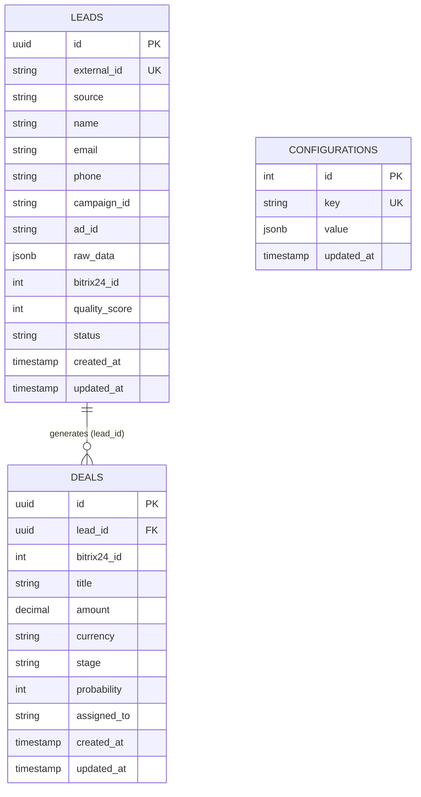

# Tích Hợp TikTok Lead Generation Với Bitrix24 CRM (NestJS 10)

> **Dự án dự thi Vòng 2 Developer - Đề bài: "V2 - Bai Tich hop Tiktok voi Bitrix24 - Version 1"**
> 
> Hệ thống Backend tự động hóa thu thập, xác thực bảo mật HMAC-SHA256, chuẩn hóa và đồng bộ dữ liệu Lead từ TikTok Lead Generation Ads vào hệ thống Bitrix24 CRM thông qua kiến trúc Queue bất đồng bộ BullMQ & Redis, tích hợp Rule Engine tự động chuyển đổi Deal và Dashboard phân tích hiệu suất chiến dịch thời gian thực.

---

## 1. Điểm Nổi Bật Của Giải Pháp

- **Kiến trúc Bất Đồng Bộ (Event-Driven Queue Architecture)**: Tiếp nhận Webhook TikTok và phản hồi HTTP 200 OK tức thì (<50ms). Background job được điều phối qua BullMQ & Redis với cơ chế giới hạn tốc độ (Rate Limiter 2 requests/sec) bảo vệ hạn ngạch API Bitrix24.
- **Bảo Mật Xác Thực Chữ Ký HMAC-SHA256**: Guard chuyên biệt `TikTokSignatureGuard` xác thực tính toàn vẹn payload với `TIKTOK_APP_SECRET` qua header `TikTok-Signature` (sử dụng timing-safe comparison chống tấn công Timing Attack).
- **Chuẩn Hóa Dữ Liệu & Lead Quality Scoring (0 - 100 điểm)**:
  - Tự động chuẩn hóa SĐT Việt Nam (+84 / 09x / 03x...) về chuẩn E.164.
  - Chuẩn hóa Email lowercase RFC 5322.
  - Chấm điểm chất lượng Lead Quality Score (Hot $\ge 70$, Warm $50-69$, Cold $< 50$).
  - Chống trùng lặp dữ liệu (Deduplication) hai lớp: Cơ sở dữ liệu PostgreSQL cục bộ và tra cứu CRM Bitrix24.
- **Rule Engine Chuyển Đổi Deal Tự Động**: Bộ máy đánh giá điều kiện linh hoạt (`CONTAINS`, `EQUALS`, `>`, `<`, `IN`) cho phép người dùng cấu hình quy tắc chuyển đổi Lead thành Deal, gán tự động nhân viên kinh doanh (`assigned_to`) và gửi thông báo nội bộ CRM (`im.notify.system.add`).
- **Dashboard UI & API Analytics**:
  - Web Dashboard SPA xây dựng với Tailwind CSS + Alpine.js + Chart.js tại `/dashboard`.
  - API đo lường tỷ lệ chuyển đổi (Lead to Deal, Deal to Won), chỉ số CPL (Cost Per Lead), ROI chiến dịch.
  - Xuất báo cáo CSV chuẩn **UTF-8 with BOM** (`\uFEFF`) mở trực tiếp trên Microsoft Excel không bị lỗi font tiếng Việt.
- **Swagger OpenAPI 3.0**: Tài liệu hóa toàn bộ 10 endpoints tại `/api/docs`.

---

## 2. Kiến Trúc Hệ Thống (System Architecture)

```
       +-------------------------------------------------------------+
       |               TikTok Lead Generation Forms                  |
       +-------------------------------------------------------------+
                                      |
                      POST /webhooks/tiktok/leads
                       (Header: TikTok-Signature)
                                      v
       +-------------------------------------------------------------+
       |                  TikTokSignatureGuard                       |
       |              (HMAC-SHA256 Verification)                     |
       +-------------------------------------------------------------+
                                      |
                                      v
       +-------------------------------------------------------------+
       |                  TikTokWebhookController                    |
       |  - Lưu raw_data JSONB vào PostgreSQL (status: 'pending')    |
       |  - Phản hồi HTTP 200 OK ngay lập tức (< 50ms)               |
       |  - Đẩy job vào BullMQ Queue (tiktok-leads-queue)            |
       +-------------------------------------------------------------+
                                      |
                                      v
                           [ Redis / BullMQ Queue ]
                       (Rate Limiter 2/s, Retry 3x, DLQ)
                                      |
                                      v
       +-------------------------------------------------------------+
       |                    TikTokLeadConsumer                       |
       |  1. Chuẩn hóa Phone E.164, Email, Phân loại Source          |
       |  2. Tính điểm Lead Quality Score (0 - 100)                  |
       |  3. Deduplication Check (Email / Phone)                     |
       +-------------------------------------------------------------+
                     /                                 \
                    v                                   v
       +-------------------------+         +-------------------------+
       |     Bitrix24Service     |         |    RuleEngineService    |
       | - crm.lead.add/update   | <------ | - Evaluate conditions   |
       | - crm.deal.add          |         | - Auto convert to Deal  |
       | - im.notify.system.add  |         | - Assign salesperson    |
       +-------------------------+         +-------------------------+
                    |                                   |
                    v                                   v
       +-------------------------+         +-------------------------+
       |       Bitrix24 CRM      |         |   PostgreSQL Database   |
       |   (Leads, Deals, Noti)  |         |  (leads, deals, configs)|
       +-------------------------+         +-------------------------+
```

---

## 3. Thiết Kế Cơ Sở Dữ Liệu (Database Schema & ERD)



### Bảng `leads`
| Cột | Kiểu dữ liệu | Mô tả |
| :--- | :--- | :--- |
| `id` | UUID (PK) | Định danh duy nhất của Lead |
| `external_id` | VARCHAR(255) | TikTok Event ID hoặc Lead ID (Unique) |
| `source` | VARCHAR(50) | Nguồn lead (`tiktok`) |
| `name` | VARCHAR(255) | Họ tên khách hàng |
| `email` | VARCHAR(255) | Email chuẩn hóa lowercase |
| `phone` | VARCHAR(50) | Số điện thoại chuẩn hóa E.164 (+84...) |
| `campaign_id` | VARCHAR(255) | Mã chiến dịch TikTok |
| `ad_id` | VARCHAR(255) | Mã mẫu quảng cáo |
| `raw_data` | JSONB | Toàn bộ payload nguyên bản để phục vụ audit/debug |
| `bitrix24_id` | INTEGER | ID Lead tương ứng trên Bitrix24 CRM |
| `quality_score` | INTEGER | Điểm chất lượng Lead (0 - 100) |
| `status` | VARCHAR(50) | Trạng thái: `pending`, `processed`, `converted` |
| `created_at` | TIMESTAMP | Thời gian tiếp nhận |
| `updated_at` | TIMESTAMP | Thời gian cập nhật |

### Bảng `deals`
| Cột | Kiểu dữ liệu | Mô tả |
| :--- | :--- | :--- |
| `id` | UUID (PK) | Định danh Deal |
| `lead_id` | UUID (FK) | Liên kết với bảng `leads` |
| `bitrix24_id` | INTEGER | ID Deal trên Bitrix24 CRM |
| `title` | VARCHAR(255) | Tên Deal |
| `amount` | DECIMAL(12,2)| Giá trị giao dịch dự kiến |
| `currency` | VARCHAR(3) | Đơn vị tiền tệ (`VND`) |
| `stage` | VARCHAR(50) | Giai đoạn Deal (`NEW`, `PREPARATION`, `WON`...) |
| `probability` | INTEGER | Xác suất chốt deal (0 - 100%) |
| `assigned_to` | VARCHAR(50) | ID nhân viên phụ trách trên CRM |
| `created_at` | TIMESTAMP | Thời gian tạo Deal |
| `updated_at` | TIMESTAMP | Thời gian cập nhật |

### Bảng `configurations`
| Cột | Kiểu dữ liệu | Mô tả |
| :--- | :--- | :--- |
| `id` | SERIAL (PK) | Khóa chính tự tăng |
| `key` | VARCHAR(255) | Tên cấu hình (`field_mapping`, `deal_rules`) |
| `value` | JSONB | Nội dung cấu hình dạng JSON |
| `updated_at` | TIMESTAMP | Thời gian cập nhật |

---

## 4. Danh Mục Các API Endpoints Hệ Thống

| STT | Phương thức | Endpoint | Mô tả |
| :---: | :---: | :--- | :--- |
| **1** | `POST` | `/webhooks/tiktok/leads` | Tiếp nhận webhook từ TikTok Lead Gen Forms (xác thực HMAC-SHA256) |
| **2** | `POST` | `/webhooks/tiktok/conversions` | Tiếp nhận & kích hoạt sự kiện chuyển đổi ngược về TikTok Events API |
| **3** | `POST` | `/webhooks/bitrix24/deals` | Tiếp nhận sự kiện cập nhật trạng thái Deal từ Bitrix24 CRM |
| **4** | `GET` | `/api/v1/leads?page=1&limit=10&source=tiktok` | Lấy danh sách leads có phân trang và bộ lọc |
| **5** | `POST` | `/api/v1/leads/batch` | **Batch Processing Migration**: Nhập hàng loạt leads lịch sử vào hàng đợi |
| **6** | `POST` | `/api/v1/leads/:id/convert-to-deal` | Chuyển đổi thủ công một Lead thành Deal và đồng bộ Bitrix24 |
| **7** | `GET` | `/api/v1/deals?status=open&assigned_to=1` | Lấy danh sách Deals trên CRM theo bộ lọc |
| **8** | `GET` | `/api/v1/queue/dlq` | Lấy danh sách các jobs thất bại trong Dead Letter Queue (DLQ) |
| **9** | `POST` | `/api/v1/queue/dlq/retry` | Kích hoạt thử lại (retry) toàn bộ các jobs trong DLQ |
| **10**| `DELETE`| `/api/v1/queue/dlq` | Xóa sạch các jobs thất bại trong DLQ |
| **11**| `GET` | `/api/v1/config/mappings` | Lấy cấu hình ánh xạ trường TikTok sang Bitrix24 |
| **12**| `PUT` | `/api/v1/config/mappings` | Cập nhật cấu hình ánh xạ trường |
| **13**| `GET` | `/api/v1/config/rules` | Lấy danh sách quy tắc Rule Engine chuyển đổi Deal |
| **14**| `PUT` | `/api/v1/config/rules` | Cập nhật danh sách quy tắc Rule Engine |
| **15**| `GET` | `/api/v1/analytics/conversion-rates` | Thống kê tỷ lệ chuyển đổi Lead-to-Deal và Deal-to-Won |
| **16**| `GET` | `/api/v1/analytics/campaign-performance` | Thống kê hiệu suất chiến dịch, CPL và ROI |
| **17**| `GET` | `/api/v1/reports/export?format=csv&date_range=30d` | Xuất file báo cáo định dạng CSV (UTF-8 BOM) hoặc JSON |
| **18**| `GET` | `/api/v1/reports/scheduled-summary` | Báo cáo định kỳ tổng hợp hiệu suất chuyển đổi và chiến dịch |
| **19**| `POST` | `/api/v1/reports/trigger-alert` | Kích hoạt cảnh báo tự động khi phát hiện Hot Leads hoặc tỷ lệ bất thường |
| **20**| `GET` | `/dashboard` | Giao diện Web Dashboard trực quan (Tailwind CSS + Alpine.js + Chart.js) |
| **21**| `GET` | `/api/docs` | Swagger OpenAPI Documentation tương tác trực tuyến |
| **22**| `GET` | `/health` | Kiểm tra trạng thái hoạt động của Postgres & Redis |

---

## 5. Hướng Dẫn Cài Đặt & Khởi Chạy

### 5.1. Yêu Cầu Môi Trường
- **Node.js**: >= 18.x (khuyến nghị v20.x hoặc v24.x)
- **PostgreSQL**: >= 15
- **Redis**: >= 7

### 5.2. Chạy Cục Bộ (Local Development)

1. Cài đặt các thư viện phụ thuộc:
```bash
npm install
```

2. Tạo file cấu hình môi trường `.env`:
```env
PORT=3000
NODE_ENV=development

DATABASE_HOST=localhost
DATABASE_PORT=5432
DATABASE_USER=postgres
DATABASE_PASSWORD=postgres
DATABASE_NAME=tiktok_bitrix24

REDIS_HOST=localhost
REDIS_PORT=6379

TIKTOK_APP_SECRET=tiktok_secret_demo
BYPASS_WEBHOOK_SIGNATURE=false

BITRIX24_WEBHOOK_URL=https://b24-lgjau5.bitrix24.vn/rest/1/jis7d07lt4b98fqe/
```

3. Nạp cấu hình mẫu ban đầu (Seed data):
```bash
npm run seed
```

4. Khởi động máy chủ ứng dụng:
```bash
npm run start:dev
```
- Web Dashboard: [http://localhost:3000/dashboard](http://localhost:3000/dashboard)
- Swagger OpenAPI: [http://localhost:3000/api/docs](http://localhost:3000/api/docs)
- Health Check: [http://localhost:3000/health](http://localhost:3000/health)

### 5.3. Chạy Bằng Docker Compose

Toàn bộ hệ thống bao gồm PostgreSQL, Redis và Ứng dụng NestJS được đóng gói hoàn chỉnh:
```bash
docker-compose up -d --build
```
Kiểm tra trạng thái container:
```bash
docker-compose ps
```

---

## 6. Thử Nghiệm & Công Cụ Tiện Ích

### 6.1. Gửi Mock TikTok Webhook Lead
Dự án cung cấp công cụ `scripts/mock-tiktok-webhook.ts` tạo payload chuẩn từ TikTok Ads Form, tự động ký chữ ký số HMAC-SHA256 và gửi HTTP POST đến ứng dụng:

```bash
# Gửi Lead mẫu chuẩn có chữ ký HMAC-SHA256:
npm run mock:webhook
```
Hoặc chỉ định thông tin tùy biến:
```bash
npx ts-node scripts/mock-tiktok-webhook.ts "Trần Thị B" "0912345678" "tranthib@gmail.com"
```

### 6.2. Chạy Batch Historical Migration (Di Chuyển Dữ Liệu Lịch Sử)
Xử lý hàng loạt các Lead cũ từ file export TikTok hoặc database legacy vào BullMQ Queue:

```bash
npm run migrate:historical
```

### 6.3. Xuất Tài Liệu Swagger OpenAPI JSON
Tự động trích xuất toàn bộ đặc tả OpenAPI thành file tĩnh `docs/swagger.json` và `swagger.json`:

```bash
npm run export:swagger
```

---

## 7. Kiểm Thử (Unit Tests & Coverage)

Dự án áp dụng Test-Driven Development (TDD) với Jest, kiểm thử toàn diện các module nhạy cảm: Guard xác thực, chuẩn hóa dữ liệu, tính điểm chất lượng, Rule Engine và Analytics.

```bash
# Chạy toàn bộ Unit Tests
npm test

# Chạy kiểm tra độ bao phủ mã nguồn (Coverage >= 80%)
npm run test:cov
```

---

## 8. Phân Tích Kỹ Thuật & Đề Xuất Cho Production

1. **Bảo vệ chống nghẽn và vượt quá Rate Limit Bitrix24**: Bitrix24 áp dụng giới hạn tối đa 2 calls/giây trên Inbound Webhook. BullMQ Rate Limiter kết hợp Redis Token Bucket đảm bảo ứng dụng không bao giờ bị trả về lỗi HTTP 429 Too Many Requests.
2. **Cơ chế Idempotency & Replay Attack**: Mỗi request Webhook TikTok mang `event_id` duy nhất và timestamp. Hệ thống kiểm tra trùng lặp trước khi tiếp nhận và từ chối các webhook có độ lệch thời gian $> 5$ phút để ngăn chặn replay attacks.
3. **Dead Letter Queue (DLQ)**: Khi một job xử lý thất bại sau 3 lần thử lại theo cơ chế Exponential Backoff (2s, 4s, 8s), job sẽ tự động được chuyển sang `tiktok-leads-dlq` để các kỹ sư vận hành phân tích lỗi mà không làm gián đoạn hàng đợi chính.
4. **Excel Compatibility**: File CSV xuất ra luôn được đính kèm ký tự UTF-8 BOM (`\uFEFF`), giúp người dùng Việt Nam mở trực tiếp file báo cáo trong Microsoft Excel trên Windows/Mac mà không bao giờ bị vỡ font chữ tiếng Việt.

---

## 9. Hướng Dẫn Xử Lý Sự Cố (Troubleshooting & FAQs)

| Vấn đề / Lỗi | Nguyên nhân | Cách khắc phục & Cơ chế tự phục hồi của hệ thống |
| :--- | :--- | :--- |
| **Lỗi HTTP 401 khi Webhook gửi thông báo (`im.notify.system.add`)** | Inbound Webhook của Bitrix24 chưa được bật quyền module Tin nhắn (Instant Messenger `im`). | **Cơ chế Fallback thông minh:** Hệ thống tự động bắt lỗi và chuyển nội dung thông báo thành ghi chú Lịch sử dòng thời gian CRM (`crm.timeline.comment.add`) gắn trực tiếp vào Lead và Deal, đảm bảo không bao giờ bị mất thông tin hay crash ứng dụng. |
| **Lỗi HTTP 401: `Invalid or missing signature`** | Header `TikTok-Signature` không khớp với chữ ký HMAC-SHA256 tính từ `TIKTOK_APP_SECRET`. | 1. Khi test giả lập, sử dụng script có sẵn `npm run mock:webhook` (script tự tính hash chuẩn).<br>2. Nếu muốn tạm thời bỏ qua xác thực chữ ký khi debug: đặt `BYPASS_WEBHOOK_SIGNATURE=true` trong file `.env`. |
| **Cảnh báo BullMQ: `Eviction policy is allkeys-lru`** | Redis cục bộ đang để cấu hình mặc định LRU thay vì `noeviction`. | Trong môi trường phát triển (Development/Testing), cảnh báo này không ảnh hưởng. Trong môi trường Production, sửa file `redis.conf`: `maxmemory-policy noeviction` để tránh Redis tự động giải phóng các job đang chờ. |
| **Job bị lỗi khi gọi Bitrix24 bị gián đoạn mạng** | Mạng chập chờn hoặc Bitrix24 timeout. | BullMQ tự động retry 3 lần với exponential backoff. Nếu sau 3 lần vẫn lỗi, job sẽ chuyển vào `tiktok-leads-dlq`. Người dùng chỉ cần vào Web Dashboard tab **Queue & DLQ** và bấm **"Thử Lại Toàn Bộ"** khi mạng ổn định lại. |
| **Mở file CSV trên Microsoft Excel bị lỗi font tiếng Việt** | Trình đọc Excel không nhận diện được UTF-8 nếu thiếu byte đánh dấu. | Toàn bộ dữ liệu xuất qua `GET /api/v1/reports/export?format=csv` đã được tự động gắn mã **UTF-8 BOM (`\uFEFF`)**, đảm bảo mở trực tiếp hiển thị 100% tiếng Việt chuẩn trên mọi phiên bản Excel Windows và macOS. |

