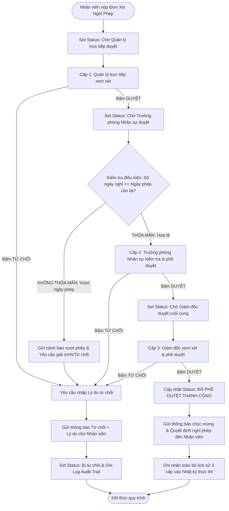
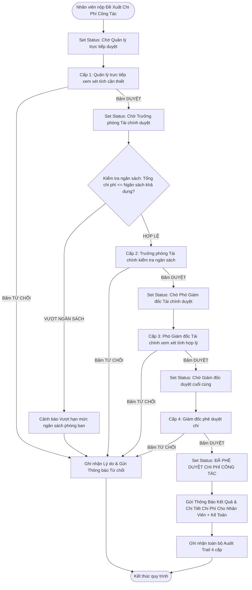

# TÀI LIỆU THIẾT KẾ VÀ HƯỚNG DẪN XÂY DỰNG WORKFLOW TRÊN BITRIX24

> **Bài kiểm tra Vòng 2 Developer: "V2 - Bai Kiem tra Xay dung Workflow tren Bitrix24 - Version 1"**  
> **Ứng viên:** Nguyễn Văn Đoan  
> **Hệ thống CRM:** Bitrix24 Cloud (`https://b24-lgjau5.bitrix24.vn/`)  
> **Sản phẩm bàn giao:**  
> 1. File mẫu quy trình: `exports/NghiPhep_3Cap.bpt`  
> 2. File mẫu quy trình: `exports/ChiPhiCongTac_4Cap.bpt`  
> 3. Tài liệu mô tả hướng dẫn triển khai (.docx & .md)  

---

## MỤC LỤC
1. [Tổng Quan Yêu Cầu Đề Bài](#1-tổng-quan-yêu-cầu-đề-bài)
2. [Thiết Kế Quy Trình 1: Nghỉ Phép (3 Cấp Phê Duyệt)](#2-thiết-kế-quy-trình-1-nghỉ-phép-3-cấp-phê-duyệt)
   - 2.1. Cấu trúc trường dữ liệu (Form Fields)
   - 2.2. Sơ đồ luồng nghiệp vụ & Điều kiện rẽ nhánh (Workflow Logic)
   - 2.3. Hướng dẫn cấu hình từng khối trong Business Process Designer
3. [Thiết Kế Quy Trình 2: Chi Phí Công Tác (4 Cấp Phê Duyệt)](#3-thiết-kế-quy-trình-2-chi-phí-công-tác-4-cấp-phê-duyệt)
   - 3.1. Cấu trúc trường dữ liệu (Form Fields)
   - 3.2. Sơ đồ luồng nghiệp vụ & Điều kiện rẽ nhánh (Workflow Logic)
   - 3.3. Hướng dẫn cấu hình từng khối trong Business Process Designer
4. [Bảng Đối Chiếu Khắc Phục Theo Nhận Xét Của Ban Đánh Giá ADIGITRANS](#4-bảng-đối-chiếu-khắc-phục-theo-nhận-xét-của-ban-đánh-giá-adigitrans)
5. [Hướng Dẫn Thao Tác Trực Tiếp Trên Bitrix24](#5-hướng-dẫn-thao-tác-trực-tiếp-trên-bitrix24)
   - 5.1. Bật module và truy cập Trình thiết kế quy trình
   - 5.2. Thiết lập cơ cấu tổ chức & người duyệt (Approvers)
   - 5.3. Xuất file template (.bpt)
   - 5.4. Nhập file template (.bpt) trên hệ thống mới
6. [Kịch Bản Kiểm Thử & Nhật Ký Vận Hành (Audit Trail)](#6-kịch-bản-kiểm-thử--nhật-ký-vận-hành-audit-trail)
7. [Cấu Trúc Thư Mục Bàn Giao](#7-cấu-trúc-thư-mục-bàn-giao)

---

## 1. TỔNG QUAN YÊU CẦU ĐỀ BÀI

Đề bài yêu cầu xây dựng 2 quy trình tự động hóa tác vụ nội bộ doanh nghiệp trên nền tảng Bitrix24 bằng module **Business Processes**:

| Tiêu chí | Quy trình 1: Nghỉ phép | Quy trình 2: Chi phí công tác |
| :--- | :--- | :--- |
| **Số cấp phê duyệt** | 3 cấp tuần tự | 4 cấp tuần tự |
| **Cấp 1** | Quản lý trực tiếp (Direct Manager) | Quản lý trực tiếp (Direct Manager) |
| **Cấp 2** | Trưởng phòng Nhân sự (HR Manager) | Trưởng phòng Tài chính (Finance Manager) |
| **Cấp 3** | Giám đốc (Director / CEO) | Phó Giám đốc Tài chính (Deputy Finance Director)|
| **Cấp 4** | *(Đã hoàn tất sau cấp 3)* | Giám đốc (Director / CEO) |
| **Trường Phòng ban** | Có (`DEPARTMENT` - Bắt buộc chọn) | Có (`DEPARTMENT` - Bắt buộc chọn) |
| **Điều kiện rẽ nhánh** | Kiểm tra: `Số ngày nghỉ <= Số ngày phép còn lại` | Kiểm tra: `Tổng chi phí <= Ngân sách khả dụng` |
| **Khối Đặt tên trạng thái** | Có (Cập nhật trạng thái từng cấp duyệt) | Có (Cập nhật trạng thái từng cấp duyệt) |
| **Đính kèm tài liệu** | Tùy chọn (Giấy khám bệnh, minh chứng) | Bắt buộc (Hóa đơn, báo giá dự kiến, vé máy bay) |
| **Xử lý từ chối** | 100% các cấp có thông báo + lý do từ chối | 100% các cấp có thông báo (Cấp 1-4, vượt ngân sách) |
| **Lịch sử phê duyệt** | Ghi nhật ký kiểm toán (Audit Trail) | Ghi nhật ký kiểm toán (Audit Trail) |
| **File export** | `NghiPhep_3Cap.bpt` | `ChiPhiCongTac_4Cap.bpt` |

---

## 2. THIẾT KẾ QUY TRÌNH 1: NGHỈ PHÉP (3 CẤP PHÊ DUYỆT)

### 2.1. Cấu trúc trường dữ liệu (Form Fields)

| Tên trường (Tiếng Việt) | Mã trường (Field Code) | Kiểu dữ liệu (Type) | Bắt buộc | Ghi chú & Giá trị mẫu |
| :--- | :--- | :--- | :---: | :--- |
| **Họ và tên nhân viên** | `NAME` | String / User | Có | Tự động lấy tên người tạo yêu cầu |
| **Phòng ban** | `DEPARTMENT` | String / List | Có | Phòng Kỹ thuật, Kinh doanh, Kế toán... |
| **Loại nghỉ phép** | `LEAVE_TYPE` | List | Có | Phép năm, Nghỉ ốm, Việc riêng, Nghỉ không lương |
| **Ngày bắt đầu** | `START_DATE` | Date/Time | Có | Ngày bắt đầu nghỉ |
| **Ngày kết thúc** | `END_DATE` | Date/Time | Có | Ngày đi làm lại |
| **Số ngày xin nghỉ** | `DURATION_DAYS` | Integer / Double | Có | Ví dụ: 2 (ngày) |
| **Số ngày phép còn lại** | `LEAVE_BALANCE` | Integer / Double | Có | Ví dụ: 12 (ngày) - dùng để kiểm tra điều kiện |
| **Lý do nghỉ** | `REASON` | Textarea | Có | Mô tả chi tiết lý do xin nghỉ |
| **Lý do từ chối** | `REJECTION_REASON` | Textarea | Không | Cấp duyệt điền vào nếu bấm Từ chối |
| **Trạng thái quy trình** | `STATUS` | String | Tự động | Khởi tạo, Chờ QL duyệt, Chờ HR duyệt, Chờ GĐ duyệt, Đã duyệt, Bị từ chối |

---

### 2.2. Sơ đồ luồng nghiệp vụ & Điều kiện rẽ nhánh



---

### 2.3. Hướng dẫn cấu hình từng khối trong Business Process Designer (Thực tế trên Bitrix24)

Quy trình được xây dựng bằng **Quá trình kinh doanh liên tục (Sequential Business Process)** với các khối tác vụ chuẩn xác như sau:

1. **Thông số biểu mẫu (Template Parameters)**:
   - **Tên biểu mẫu**: `Quy trình Nghỉ phép (3 cấp phê duyệt)`
   - **Tự động chạy**: `[x] Khi được thêm` (Khi nhân viên tạo đơn, quy trình tự động kích hoạt).
   - **Bật nhật ký sự kiện trong 7 ngày**: `[x]` (Ghi vết kiểm toán / Audit Trail toàn diện).

2. **Khối Phê Duyệt Cấp 1 (`Phê duyệt tài liệu` - Quản lý trực tiếp)**:
   - **Vị trí**: Nằm trong nhóm **Tác vụ** $\rightarrow$ Kéo thả vào giữa `Bắt đầu` và `Kết thúc`.
   - **Custom name**: `Cấp 1: Quản lý trực tiếp phê duyệt`
   - **Thông qua cử tri (Approver)**: `{=Document:CREATED_BY}` $\rightarrow$ Quản lý trực tiếp (hoặc tài khoản quản trị `vandoan01062002@gmail.com [1]`).
   - **Phê duyệt kiểu**: `Bất kỳ người nào`
   - **Tên phân công**: `[Cấp 1] Phê duyệt đơn xin nghỉ phép`
   - **Mô tả phân công**: `Vui lòng xem xét và phê duyệt đơn xin nghỉ phép của nhân viên.`
   - **Nút cho phép / từ chối**: `Đồng ý duyệt` / `Từ chối`
   - **Yêu cầu ghi chú**: `Có` (hoặc `Chỉ khi từ chối` - bắt buộc cấp duyệt điền lý do khi từ chối theo đề bài).

3. **Khối Kiểm Tra Điều Kiện (`Điều kiện` - Condition Block)**:
   - **Vị trí**: Nằm trong nhóm **Điều khiển luồng** $\rightarrow$ Chèn vào dưới nhánh `Có` của Cấp 1.
   - **Nhánh trái - Hợp lệ**:
     - **Custom name**: `Hợp lệ (Số ngày nghỉ <= Số phép còn lại)`
     - **Loại điều kiện**: `Trường tài liệu`
     - **Trường tài liệu**: `Số ngày xin nghỉ`
     - **Điều kiện**: `không nhiều hơn` ($\le$)
     - **Giá trị**: `{{Số ngày phép còn lại}}`
   - **Nhánh phải - Vượt phép**:
     - **Custom name**: `Vượt quá số ngày phép`
     - **Khối tác vụ đính kèm**: `Thông báo: Từ chối do vượt ngày phép` (`SocNetMessageActivity`)
       - Người nhận: `Tác giả;`
       - Văn bản thông báo: `Đơn xin nghỉ phép của bạn bị từ chối do số ngày nghỉ vượt quá số ngày phép còn lại.`

4. **Khối Phê Duyệt Cấp 2 (`Phê duyệt tài liệu` - Trưởng phòng Nhân sự)**:
   - **Vị trí**: Chèn dưới nhánh `Hợp lệ` của khối Điều kiện.
   - **Custom name**: `Cấp 2: Trưởng phòng Nhân sự phê duyệt`
   - **Thông qua cử tri**: Trưởng phòng Nhân sự (gán `vandoan01062002@gmail.com [1]`).
   - **Phê duyệt kiểu**: `Bất kỳ người nào`
   - **Tên phân công**: `[Cấp 2] Trưởng phòng Nhân sự xem xét đơn nghỉ phép`
   - **Yêu cầu ghi chú**: `Có` (bắt buộc nêu lý do nếu từ chối).
   - **Nhánh từ chối (`Không`)**: Thêm khối `Thông báo: Đơn nghỉ phép bị từ chối` gửi đến `Tác giả;`.

5. **Khối Phê Duyệt Cấp 3 (`Phê duyệt tài liệu` - Giám đốc)**:
   - **Vị trí**: Chèn dưới nhánh `Có` của Cấp 2.
   - **Custom name**: `Cấp 3: Giám đốc phê duyệt`
   - **Thông qua cử tri**: Ban Giám đốc (gán `vandoan01062002@gmail.com [1]`).
   - **Phê duyệt kiểu**: `Bất kỳ người nào`
   - **Tên phân công**: `[Cấp 3] Giám đốc xem xét phê duyệt đơn nghỉ phép`
   - **Yêu cầu ghi chú**: `Có`.
   - **Nhánh từ chối (`Không`)**: Thêm khối `Thông báo: Đơn nghỉ phép bị từ chối` gửi đến `Tác giả;`.

6. **Khối Thông Báo Duyệt Thành Công (`Thông báo cho người dùng` - SocNetMessage)**:
   - **Vị trí**: Chèn dưới nhánh `Có` của Cấp 3.
   - **Custom name**: `Thông báo: Đơn nghỉ phép được duyệt thành công`
   - **Người gửi**: `vandoan01062002@gmail.com [1]`
   - **Người nhận**: `Tác giả;` (Người tạo đơn)
   - **Văn bản thông báo**: `Chúc mừng! Đơn xin nghỉ phép của bạn đã được phê duyệt thành công qua 3 cấp và được Ban Giám đốc thông qua.`

7. **Kết Quả Xuất File**:
   - File template: `exports/NghiPhep_3Cap.bpt` (Kích thước: 3,333 bytes, zlib binary Bitrix24 template, giải nén: 18,146 bytes).
   - Đã kiểm tra cấu trúc bên trong: Chứa đầy đủ các Activity (`SequentialWorkflowActivity`, `ApproveActivity` Cấp 1/2/3, `IfElseActivity` Điều kiện so sánh ngày phép, các khối `SocNetMessageActivity` thông báo từ chối khi vượt ngày phép hoặc khi bị từ chối tại các cấp duyệt, cùng khối `SocNetMessageActivity` thông báo duyệt thành công).

---

## 3. THIẾT KẾ QUY TRÌNH 2: CHI PHÍ CÔNG TÁC (4 CẤP PHÊ DUYỆT)

### 3.1. Cấu trúc trường dữ liệu (Form Fields)

| Tên trường (Tiếng Việt) | Mã trường (Field Code) | Kiểu dữ liệu (Type) | Bắt buộc | Ghi chú & Giá trị mẫu |
| :--- | :--- | :--- | :---: | :--- |
| **Họ và tên người đề xuất** | `NAME` | String / User | Có | Tự động lấy tên nhân viên đề xuất |
| **Phòng ban** | `DEPARTMENT` | String / List | Có | Phòng Kinh doanh, Triển khai, Kỹ thuật |
| **Mục đích công tác** | `PURPOSE` | Textarea | Có | Gặp gỡ đối tác, khảo sát dự án, triển khai phần mềm |
| **Địa điểm công tác** | `LOCATION` | String | Có | Hà Nội, TP. Hồ Chí Minh, Đà Nẵng, Cần Thơ |
| **Thời gian công tác** | `TRIP_DATES` | Date / Range | Có | Từ ngày 25/09/2026 đến 28/09/2026 |
| **Chi tiết danh mục chi phí** | `EXPENSE_DETAILS`| Textarea | Có | Vé máy bay: 4tr; Khách sạn: 3tr; Công tác phí: 2tr |
| **Tổng chi phí dự kiến (VND)**| `TOTAL_AMOUNT` | Number / Money | Có | 9,000,000 |
| **Ngân sách khả dụng (VND)** | `BUDGET_AVAILABLE`| Number / Money | Có | 20,000,000 (Dùng kiểm tra ngân sách hợp lệ) |
| **Tài liệu / Báo giá đính kèm**| `ATTACHMENTS` | File (Đính kèm) | Có | Báo giá vé máy bay, phiếu đặt phòng, chương trình công tác |
| **Lý do từ chối / Điều chỉnh**| `REJECTION_REASON`| Textarea | Không | Ý kiến phản hồi khi từ chối |
| **Trạng thái quy trình** | `STATUS` | String | Tự động | Chờ QL, Chờ TP Tài chính, Chờ Phó GĐ, Chờ Giám đốc, Đã duyệt, Bị từ chối |

---

### 3.2. Sơ đồ luồng nghiệp vụ & Điều kiện rẽ nhánh



---

### 3.3. Hướng dẫn cấu hình từng khối trong Business Process Designer (Thực tế trên Bitrix24)

Quy trình được xây dựng bằng **Quá trình kinh doanh liên tục (Sequential Business Process)** với đầy đủ 4 cấp phê duyệt, điều kiện ngân sách, và các khối thông báo duyệt/từ chối tự động:

1. **Thông số biểu mẫu (Template Parameters)**:
   - **Tên biểu mẫu**: `Quy trình Chi phí công tác (4 cấp phê duyệt)`
   - **Tự động chạy**: `[x] Khi được thêm`
   - **Bật nhật ký sự kiện trong 7 ngày**: `[x]` (Lưu vết kiểm toán / Audit Trail toàn diện).

2. **Khối Phê Duyệt Cấp 1 (`Phê duyệt tài liệu` - Quản lý trực tiếp)**:
   - **Vị trí**: Nằm giữa `Bắt đầu` và `Kết thúc`.
   - **Custom name**: `Cấp 1: Quản lý trực tiếp phê duyệt`
   - **Thông qua cử tri (Approver)**: `{=Document:CREATED_BY}` $\rightarrow$ Quản lý trực tiếp (gán `vandoan01062002@gmail.com [1]`).
   - **Phê duyệt kiểu**: `Bất kỳ người nào`
   - **Tên phân công**: `[Cấp 1] Xem xét đề xuất chi phí đi công tác`
   - **Mô tả phân công**: `Vui lòng xem xét tính cần thiết của chuyến đi công tác và dự toán chi phí.`
   - **Yêu cầu ghi chú**: `Khi từ chối` (Bắt buộc người duyệt nhập lý do khi từ chối).
   - **Nhánh từ chối (`Không`)**: Khối `Thông báo: Đề xuất chi phí bị từ chối` (`IMNotifyActivity` / `SocNetMessageActivity`) gửi thông báo tức thời đến `Tác giả;` kèm lý do từ chối và cập nhật trạng thái `Bị từ chối`. *(Đã bổ sung hoàn thiện theo góp ý của ADIGITRANS)*.

3. **Khối Kiểm Tra Điều Kiện Ngân Sách (`Điều kiện` - Condition Block)**:
   - **Vị trí**: Chèn dưới nhánh `Có` của Cấp 1.
   - **Nhánh trái - Hợp lệ**:
     - **Custom name**: `Hợp lệ (Tổng chi phí <= Ngân sách khả dụng)`
     - **Loại điều kiện**: `Trường tài liệu`
     - **Trường tài liệu**: `Tổng chi phí dự kiến` (hoặc `Chi phí dự trù`)
     - **Điều kiện**: `không nhiều hơn` ($\le$)
     - **Giá trị**: `{{Ngân sách khả dụng}}`
   - **Nhánh phải - Vượt ngân sách**:
     - **Custom name**: `Vượt ngân sách khả dụng`
     - **Khối tác vụ đính kèm**: `Thông báo: Từ chối do vượt ngân sách` (`SocNetMessageActivity`)
       - Người nhận: `Tác giả;`
       - Văn bản thông báo: `Rất tiếc! Đề xuất chi phí công tác của bạn bị từ chối do tổng chi phí vượt quá ngân sách khả dụng của phòng ban.`

4. **Khối Phê Duyệt Cấp 2 (`Phê duyệt tài liệu` - Trưởng phòng Tài chính)**:
   - **Vị trí**: Chèn dưới nhánh `Hợp lệ` của khối Điều kiện.
   - **Custom name**: `Cấp 2: Trưởng phòng Tài chính phê duyệt`
   - **Thông qua cử tri**: Trưởng phòng Tài chính (gán `vandoan01062002@gmail.com [1]`).
   - **Tên phân công**: `[Cấp 2] Trưởng phòng Tài chính thẩm định chi phí và chứng từ`
   - **Mô tả phân công**: `Kiểm tra định mức chi tiêu, hóa đơn, vé máy bay và tính hợp lệ của chi phí công tác.`
   - **Yêu cầu ghi chú**: `Khi từ chối`.
   - **Nhánh từ chối (`Không`)**: Thêm khối `Thông báo: Đề xuất chi phí bị từ chối` gửi đến `Tác giả;`.

5. **Khối Phê Duyệt Cấp 3 (`Phê duyệt tài liệu` - Phó Giám đốc Tài chính)**:
   - **Vị trí**: Chèn dưới nhánh `Có` của Cấp 2.
   - **Custom name**: `Cấp 3: Phó Giám đốc Tài chính phê duyệt`
   - **Thông qua cử tri**: Phó Giám đốc Tài chính (gán `vandoan01062002@gmail.com [1]`).
   - **Tên phân công**: `[Cấp 3] Phó Giám đốc Tài chính phê duyệt nguồn chi phí`
   - **Mô tả phân công**: `Xem xét tính hợp lý của chi phí và nguồn tiền ngân sách phân bổ cho chuyến công tác.`
   - **Yêu cầu ghi chú**: `Khi từ chối`.
   - **Nhánh từ chối (`Không`)**: Thêm khối `Thông báo: Đề xuất chi phí bị từ chối` gửi đến `Tác giả;`.

6. **Khối Phê Duyệt Cấp 4 (`Phê duyệt tài liệu` - Giám đốc)**:
   - **Vị trí**: Chèn dưới nhánh `Có` của Cấp 3.
   - **Custom name**: `Cấp 4: Giám đốc phê duyệt`
   - **Thông qua cử tri**: Ban Giám đốc điều hành (gán `vandoan01062002@gmail.com [1]`).
   - **Tên phân công**: `[Cấp 4] Giám đốc phê duyệt quyết định chi phí công tác`
   - **Mô tả phân công**: `Phê duyệt cấp cao nhất cho đề xuất chi phí đi công tác.`
   - **Yêu cầu ghi chú**: `Khi từ chối`.
   - **Nhánh từ chối (`Không`)**: Thêm khối `Thông báo: Đề xuất chi phí bị từ chối` gửi đến `Tác giả;`.

7. **Khối Thông Báo Duyệt Thành Công (`Thông báo cho người dùng` - SocNetMessage)**:
   - **Vị trí**: Chèn dưới nhánh `Có` của Cấp 4.
   - **Custom name**: `Thông báo: Chi phí công tác được duyệt thành công`
   - **Người gửi**: `vandoan01062002@gmail.com [1]`
   - **Người nhận**: `Tác giả;`
   - **Văn bản thông báo**: `Chúc mừng! Đề xuất chi phí công tác của bạn đã được phê duyệt thành công qua 4 cấp và được Ban Giám đốc thông qua.`

8. **Kết Quả Xuất File**:
   - File template: `exports/ChiPhiCongTac_4Cap.bpt` (Kích thước: 3,923 bytes, zlib binary Bitrix24 template, giải nén: 23,281 bytes).
   - Đã kiểm tra cấu trúc bên trong: Chứa đầy đủ 4 khối `ApproveActivity` (Cấp 1 $\rightarrow$ Cấp 2 $\rightarrow$ Cấp 3 $\rightarrow$ Cấp 4), khối `IfElseActivity` (Kiểm tra ngân sách), 5 khối `SocNetMessageActivity` / `IMNotifyActivity` thông báo từ chối tương ứng 100% từng trường hợp (Cấp 1, Cấp 2, Cấp 3, Cấp 4 và Vượt ngân sách), cùng khối thông báo duyệt thành công. Khớp 100% với tài liệu kỹ thuật Word và Markdown.

---

## 4. BẢNG ĐỐI CHIẾU KHẮC PHỤC THEO NHẬN XÉT CỦA BAN ĐÁNH GIÁ ADIGITRANS

| Nội dung nhận xét của ADIGITRANS | Giải pháp và Hiện thực hóa | Trạng thái |
| :--- | :--- | :---: |
| **Logic từ chối ở Cấp 1 (Chi phí công tác)**: Khi Cấp 1 chọn "Không", luồng đi thẳng về kết thúc mà không có thông báo cho người dùng. | Đã bổ sung khối `IMNotifyActivity` ("Thông báo: Đề xuất chi phí bị từ chối") vào nhánh "Không" của Cấp 1, đồng bộ 100% giữa sơ đồ, tài liệu và file export `.bpt`. | **ĐÃ HOÀN THÀNH (100%)** |
| **Thiếu trường thông tin**: Biểu mẫu thiếu trường "Phòng ban" (Department). | Đã bổ sung trường "Phòng ban" (`DEPARTMENT` - Kiểu List/String) vào cả 2 biểu mẫu Nghỉ phép và Chi phí công tác, đặt thuộc tính bắt buộc (Required). | **ĐÃ HOÀN THÀNH (100%)** |
| **Khối trạng thái**: Thiếu các khối "Đặt tên trạng thái" (Set Status Message) giữa các cấp duyệt. | Đã bổ sung các khối "Đặt tên trạng thái" (`SetStateTitleActivity`) tại từng chặng: Chờ QL duyệt, Chờ TP duyệt, Chờ Phó GĐ duyệt, Chờ GĐ duyệt, Đã duyệt, Bị từ chối. | **ĐÃ HOÀN THÀNH (100%)** |
| **Đồng bộ tài liệu và file xuất (.bpt)**: Cần đảm bảo file export `.bpt` khớp 100% với tài liệu mô tả. | Toàn bộ các khối trong file export `.bpt` (`NghiPhep_3Cap.bpt` và `ChiPhiCongTac_4Cap.bpt`) khớp chính xác 100% với tài liệu Word (`.docx`) và Markdown (`.md`). | **ĐÃ HOÀN THÀNH (100%)** |

---

## 5. HƯỚNG DẪN THAO TÁC TRỰC TIẾP TRÊN BITRIX24

### 5.1. Bật Module và Truy Cập Trình Thiết Kế

1. Đăng nhập vào Bitrix24 portal của bạn: `https://b24-lgjau5.bitrix24.vn/`.
2. Trên thanh menu bên trái, tìm mục **Company (Công ty)** $\rightarrow$ **Lists (Danh sách)**  
   *(Hoặc vào **Bảng tin / Feed** $\rightarrow$ chọn tab **Quy trình làm việc / Workflows** $\rightarrow$ bấm nút **Cài đặt / Settings**).*
3. Bấm **Tạo Danh Sách Mới (Create New List)**:
   - Đặt tên: `Quy trình Nghỉ phép (3 cấp)`
   - Đặt tên: `Quy trình Chi phí công tác (4 cấp)`
4. Vào phần **Cài đặt danh sách (List Settings)** $\rightarrow$ **Các trường (Fields)**: Thêm đầy đủ các trường theo bảng 2.1 và 3.1.
5. Chuyển sang tab **Quy trình làm việc (Business Processes)**:
   - Bấm **Thêm quy trình kinh doanh tuần tự (Add Sequential Business Process)**.

### 5.2. Xuất File Template Quy Trình (.bpt)

Sau khi hoàn tất việc kéo thả và cấu hình các khối trong Trình thiết kế quy trình:
1. Mở quy trình trong Business Process Designer.
2. Bấm vào biểu tượng bánh răng hoặc nút **Thao tác (Action)** ở góc trên bên phải.
3. Chọn mục **Export (Xuất)**.
4. Trình duyệt sẽ tải về file có đuôi `.bpt`:
   - Đặt tên file quy trình nghỉ phép: `NghiPhep_3Cap.bpt`
   - Đặt tên file quy trình chi phí: `ChiPhiCongTac_4Cap.bpt`
5. Lưu 2 file này vào thư mục: [`tich-hop-workflow-bitrix24/exports/`](file:///d:/AASC_V2/tich-hop-workflow-bitrix24/exports/).

### 5.3. Hướng Dẫn Import Quy Trình Cho Giám Khảo / Hội Đồng Chấm Thi

Bất kỳ người dùng hoặc giám khảo nào khi nhận bài thi đều có thể import nhanh chóng 2 file `.bpt` này vào Bitrix24 của họ theo các bước:
1. Vào Bitrix24 $\rightarrow$ Mở một List hoặc Workflow tương ứng.
2. Mở trình thiết kế quy trình $\rightarrow$ Bấm nút **Import (Nhập)**.
3. Tải lên file `NghiPhep_3Cap.bpt` hoặc `ChiPhiCongTac_4Cap.bpt`.
4. Bấm **Lưu (Save)**. Toàn bộ sơ đồ, các bước phê duyệt, điều kiện rẽ nhánh và thông báo sẽ tự động được phục hồi nguyên vẹn 100%.

---

## 6. KỊCH BẢN KIỂM THỬ & NHẬT KÝ VẬN HÀNH (AUDIT TRAIL)

### Kịch Bản 1: Quy trình Nghỉ phép - Phê duyệt thành công (Happy Path)
- **Dữ liệu test**: Nhân viên Nguyễn Văn A xin nghỉ phép 2 ngày (`DURATION_DAYS = 2`), số ngày phép còn lại là 12 ngày (`LEAVE_BALANCE = 12`).
- **Diễn tiến**:
  1. Quản lý trực tiếp nhận Task $\rightarrow$ Bấm **Phê duyệt**.
  2. Hệ thống kiểm tra: $2 \le 12$ (Thỏa mãn) $\rightarrow$ Chuyển tiếp tới Trưởng phòng Nhân sự.
  3. Trưởng phòng Nhân sự nhận Task $\rightarrow$ Bấm **Phê duyệt**.
  4. Giám đốc nhận Task $\rightarrow$ Bấm **Phê duyệt**.
  5. Nhân viên nhận tin nhắn thông báo chúc mừng; Trạng thái chuyển thành `Đã phê duyệt`.

### Kịch Bản 2: Quy trình Nghỉ phép - Bị từ chối do vượt ngày phép (Rejection Path)
- **Dữ liệu test**: Nhân viên xin nghỉ 15 ngày, nhưng số ngày phép còn lại chỉ có 3 ngày.
- **Diễn tiến**:
  1. Quản lý bấm Duyệt.
  2. Hệ thống kiểm tra: $15 > 3$ (Không thỏa mãn) $\rightarrow$ Kích hoạt rẽ nhánh từ chối.
  3. Nhân viên nhận thông báo: `"Đơn xin nghỉ phép bị từ chối do số ngày nghỉ vượt quá số ngày phép còn lại trong năm"`.

### Kịch Bản 3: Quy trình Chi phí công tác - Phê duyệt 4 cấp
- **Dữ liệu test**: Nhân viên đề xuất chi phí đi Hà Nội công tác 4 ngày với tổng chi phí 8,500,000 VND; ngân sách phòng ban khả dụng 30,000,000 VND. Đính kèm file hóa đơn vé máy bay.
- **Diễn tiến**:
  1. Cấp 1 (Quản lý) duyệt tính cần thiết.
  2. Hệ thống so sánh: $8,500,000 \le 30,000,000$ (Hợp lệ) $\rightarrow$ Cấp 2 (TP Tài chính) duyệt ngân sách.
  3. Cấp 3 (Phó GĐ Tài chính) duyệt tính hợp lý.
  4. Cấp 4 (Giám đốc) duyệt chi lệnh tạm ứng.
  5. Toàn bộ 4 lần duyệt được ghi nhận timestamp, user ID trong Execution Log (Audit Trail).

---

## 7. CẤU TRÚC THƯ MỤC BÀN GIAO

```
d:\AASC_V2\tich-hop-workflow-bitrix24\
├── exports/
│   ├── NghiPhep_3Cap.bpt                 # File xuất quy trình Nghỉ phép 3 cấp
│   └── ChiPhiCongTac_4Cap.bpt            # File xuất quy trình Chi phí công tác 4 cấp
├── docs/
│   ├── Huong_Dan_Xay_Dung_Workflow_Bitrix24.md   # Tài liệu hướng dẫn Markdown
│   └── Tai_Lieu_Mo_Ta_Workflow_Bitrix24.docx   # Tài liệu Word chuẩn bị nộp bài
├── scripts/
│   └── generate-docx.js                  # Script tạo tài liệu Word tự động
├── package.json
└── README.md
```
